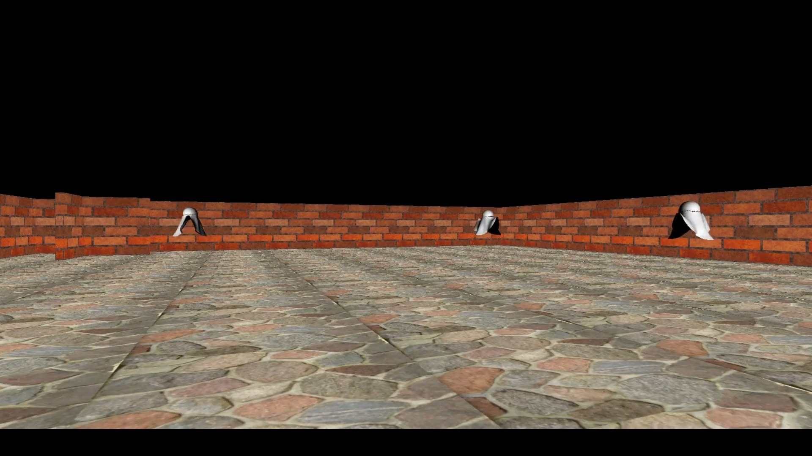
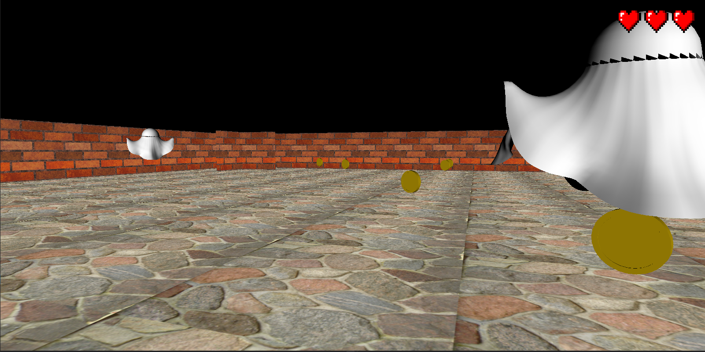
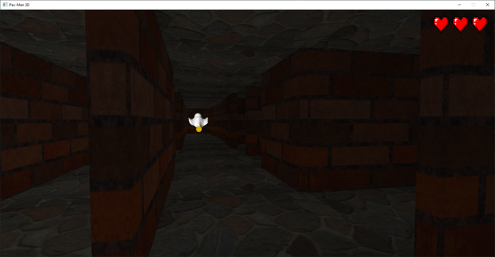
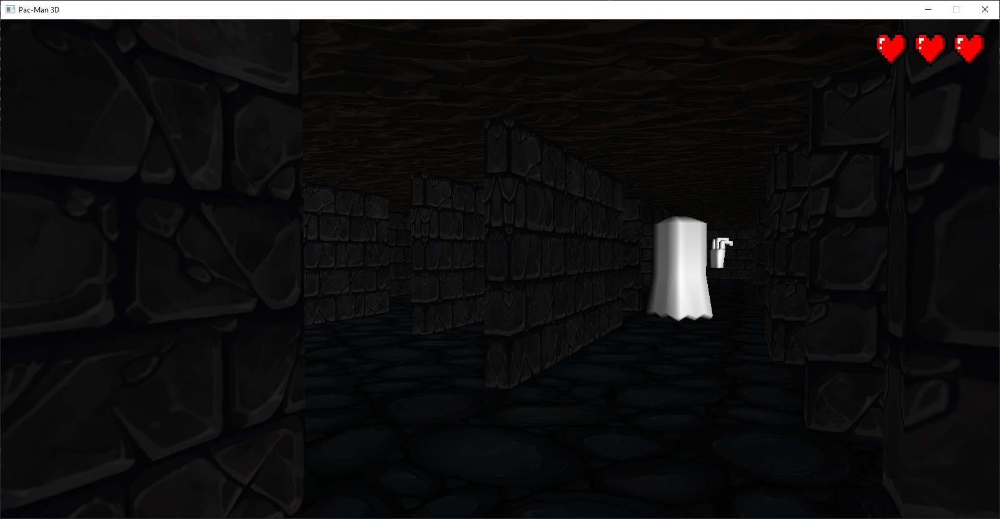

Pac-Man 3D
============
Simple 3D game for the ourposes of studies at PUT Poznan.

ToDo
----------
- [X] Add map elements: walls and floors
- [X] Add camera movement
- [X] Add ghosts
- [X] Add map loading from file
- [X] Add camera collisions with walls
- [X] Add simple AI to ghosts
- [X] Add coins
- [X] Add game statuses
- [X] Add collisions with ghosts and coins
- [X] Add torches
- [X] Add sounds
- [X] Change movement to mouse
- [X] Add victory, defeat and menu scenes
- [X] Add light sources and update shaders to create darkness
- [X] Update and beautify textures of walls and floors
- [X] Add a mechanism of eating ghosts
- [X] Randomize ghosts and coins spawn

Screenshots
----------

### Version 2022-04-10

### Version 2022-05-10

### Version 2022-06-07

### Version 2022-06-08

